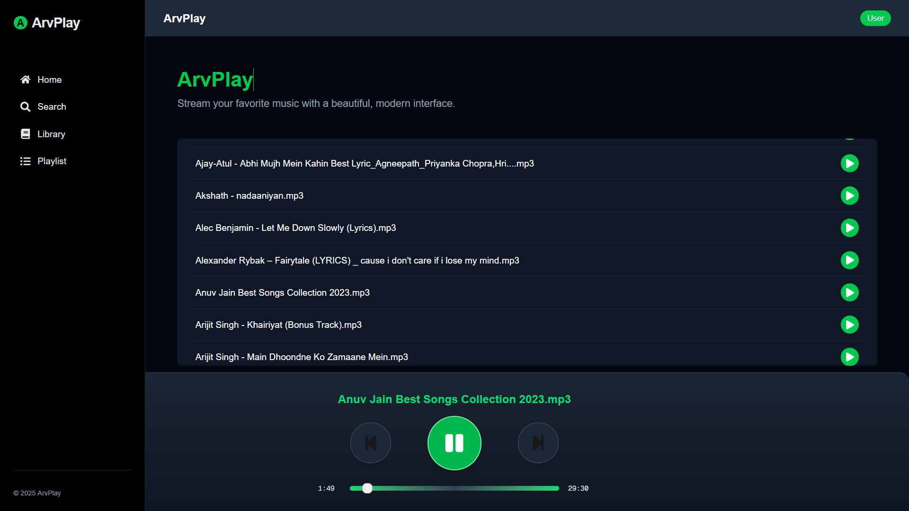

# ArvPlay 🎵

[Live Demo](https://arvplay.vercel.app/) &nbsp; | &nbsp; `https://arvplay.vercel.app/`


---

## 🖼️ Home Page



---

## About

ArvPlay is a modern, open-source music player web app. Stream your favorite songs with a beautiful, responsive interface. Built with Next.js and TypeScript, ArvPlay is designed for simplicity, speed, and a great user experience.

---

## Motivation

ArvPlay began as a hands-on project to learn Next.js and modern web development. The goal is to create a clean, minimal music player that feels fast and intuitive.

---

## Tech Stack

- **Framework:** Next.js 15 (App Router)
- **Language:** TypeScript 5
- **Styling:** Tailwind CSS 3
- **Deployment:** Vercel

---

## Features

- Play, pause, and seek songs
- Responsive UI for desktop and mobile
- Song list with audio controls
- Dismissible “work-in-progress” overlay for users

---

## Roadmap

- [x] Home page with functional player
- [x] Song list with play/pause/seek
- [ ] Library page (recently played)
- [ ] Playlist creation and management
- [ ] Search functionality
- [ ] User authentication (NextAuth.js)

---

## Work In Progress

ArvPlay is actively being developed. Features and design may change as new functionality is added.

---

## Getting Started

Clone the repo and install dependencies:

```bash
npm install
# or
yarn install
# or
pnpm install
# or
bun install
```